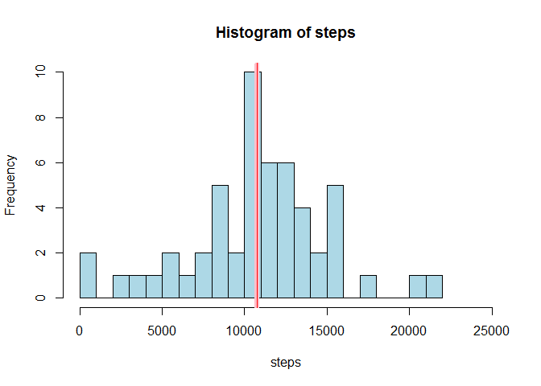
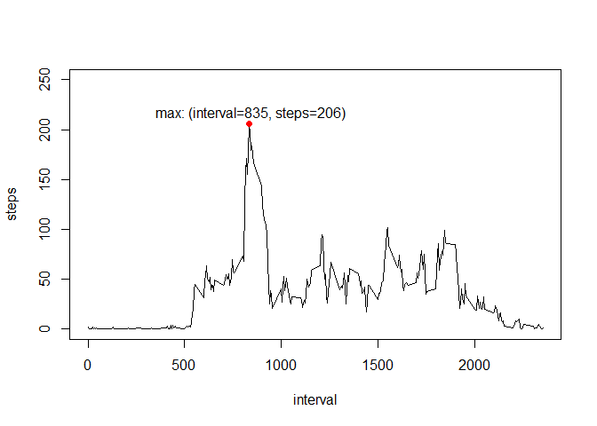
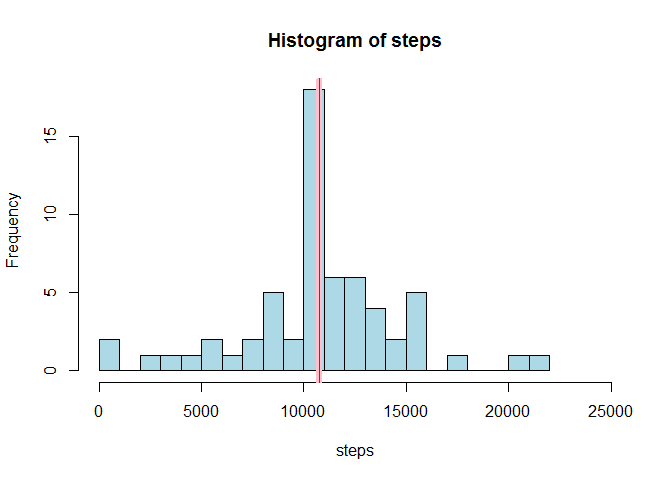

# Reproducible Research: Course Project 1
Maria Lauve  
June 22, 2017  

This assignments involves using data from activity monitoring devices to answer
questions about the activity levels of individuals tracked over 5-minute intervals
over a two-month period in October and November 2012.

# Reading in the Data


```r
activity <- read.table(file="activity.csv", sep=",", na.strings="NA", header=TRUE)
```

# Total Number of Steps per Day


```r
stepsbyday <- aggregate(steps ~ date, data=activity, sum)
meansteps <- mean(stepsbyday$steps)
mediansteps <- median(stepsbyday$steps)

with(stepsbyday, hist(steps, breaks=20, xlim=c(0,25000),
    col="lightblue"))
abline(v=meansteps, col="pink", lwd=6)
abline(v=mediansteps, col="red", lwd=1)
```

<!-- -->

The mean number of steps taken per day is `meansteps`.
The median number of steps taken per day is `median steps`.

# Average Steps per Interval


```r
library(dplyr)
```

```
## 
## Attaching package: 'dplyr'
```

```
## The following objects are masked from 'package:stats':
## 
##     filter, lag
```

```
## The following objects are masked from 'package:base':
## 
##     intersect, setdiff, setequal, union
```

```r
stepsbyint <- aggregate(steps ~ interval, data=activity, mean)
stepsort <- arrange(stepsbyint,desc(steps))
maxsteps <- stepsort[1,2]
maxint <- stepsort[1,1]

with(stepsbyint, plot(x=interval,y=steps,type="l",ylim=c(0,250)))
points(x=maxint, y=maxsteps, col="red", pch=19)
text(x=maxint+10, y=maxsteps+10, paste("max: (interval=",round(maxint,0),
    ", steps=",round(maxsteps,0),")",sep=""))
```

<!-- -->

# Imputing Missing Data


```r
NAcnt1 <- sum(is.na(activity$steps))
NAcnt2 <- sum(is.na(activity$date))
NAcnt3 <- sum(is.na(activity$interval))
```
The total number of missing "steps" values in the activity dataset is `NAcnt1`.
Note: there are no missing values in the "date" or "interval" columns.

We can impute missing values by replacing them with the average number of steps
for the respective interval as computed above.


```r
active_mrg <- merge(activity,stepsbyint,by="interval",all.x=TRUE)

missing <- active_mrg[is.na(active_mrg$steps.x),]
missing$steps <- missing$steps.y

nonmissing <- active_mrg[!is.na(active_mrg$steps.x),]
nonmissing$steps <- nonmissing$steps.x

active_impute <- rbind(missing,nonmissing)
```

# Total Number of Steps per Day Using Data with Imputed Values


```r
stepsbyday_new <- aggregate(steps ~ date, data=active_impute, sum)
meansteps_new <- mean(stepsbyday_new$steps)
mediansteps_new <- median(stepsbyday_new$steps)

with(stepsbyday_new, hist(steps, breaks=20, xlim=c(0,25000),
    col="lightblue"))
abline(v=meansteps_new, col="pink", lwd=6)
abline(v=mediansteps_new, col="red", lwd=1)
```

<!-- -->

The mean number of steps taken per day is `meansteps_new`.
The median number of steps taken per day is `median steps_new`.

Imputing the missing values left the mean unchanged and caused
the median to increase slightly to equal the mean.

# Differences in Activity Patterns: Weekdays v. Weekend


```r
active_impute$weekday <- weekdays(as.Date(active_impute$date))
active_impute$weekend <- "weekday"
active_impute$weekend[active_impute$weekday=="Saturday" |
    active_impute$weekday=="Sunday"] <- "weekend"

stepsbyint_new <- aggregate(steps ~ interval * weekend, data=active_impute, mean)

library(lattice)
xyplot(steps ~ interval | weekend, data=stepsbyint_new, layout=c(1,2), type="l")
```

<!-- -->

# *** THE END ***

